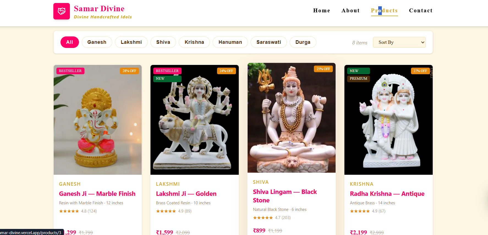

# 🕉️ SamarDivine

> A modern e-commerce web application for handcrafted Hindu religious idols and divine artifacts — built with React, Tailwind CSS, and Framer Motion.


---

## ✨ About

**SamarDivine** is a beautifully crafted e-commerce frontend for authentic, handmade Hindu religious idols and sacred artifacts. The app focuses on delivering a premium, spiritually inspired UI experience with smooth animations and a responsive layout across all devices.

---

## 🖼️ Features

- 🛕 **Product Showcase** — Browse a curated collection of handcrafted idols and divine items
- 🎨 **Rich UI/UX** — Deep spiritual color palette with gold accents and elegant typography
- 💫 **Framer Motion Animations** — Smooth entrance animations, hover effects, and transitions
- 📱 **Fully Responsive** — Optimized for mobile, tablet, and desktop
- 🧩 **Component-Based Architecture** — Clean, reusable React components
- ⚡ **Vite Powered** — Fast development and production builds

---

## 🛠️ Tech Stack

| Technology | Purpose |
|---|---|
| React 18 | UI library |
| Vite | Build tool & dev server |
| Tailwind CSS | Utility-first styling |
| Framer Motion | Animations & transitions |

---

## 📁 Project Structure

```
SamarDivine/
├── public/
│   └── assets/              # Static images and icons
├── src/
│   ├── components/          # Reusable UI components
│   │   ├── Navbar.jsx
│   │   ├── HeroSection.jsx
│   │   ├── ProductCard.jsx
│   │   ├── ServicesSection.jsx
│   │   ├── Footer.jsx
│   │   └── ...
│   ├── pages/               # Page-level components
│   ├── App.jsx
│   └── main.jsx
├── index.html
├── tailwind.config.js
├── vite.config.js
└── package.json
```

---

## 🚀 Getting Started

### Prerequisites

- Node.js v18+
- npm or yarn

### Installation

```bash
# Clone the repository
git clone https://github.com/kanchankahar23/SamarDivine.git

# Navigate into the project
cd SamarDivine

# Install dependencies
npm install

# Start the development server
npm run dev
```

The app will be running at `http://localhost:5173`

### Build for Production

```bash
npm run build
```

---

## 📸 Screenshots

### 🏠 Home Page


### 🛍️ Product Section


### Why Samar Divine


---

## 🎯 Roadmap

- [ ] Product detail page
- [ ] Shopping cart functionality
- [ ] Backend integration (Node.js + Express + MongoDB)
- [ ] Payment gateway integration
- [ ] User authentication
- [ ] Order tracking

---

## 👩‍💻 Developer

**Kanchan Kahar**
- 🎓 MCA Final Year — Shri Ram Institute of Technology, Jabalpur
- 💼 Frontend Developer Intern — White Force, Jabalpur
- 🔗 [GitHub](https://github.com/kanchankahar23)

---

## 📄 License

This project is open source and available under the [MIT License](LICENSE).

---

<p align="center">Made with ❤️ and devotion 🙏</p>
